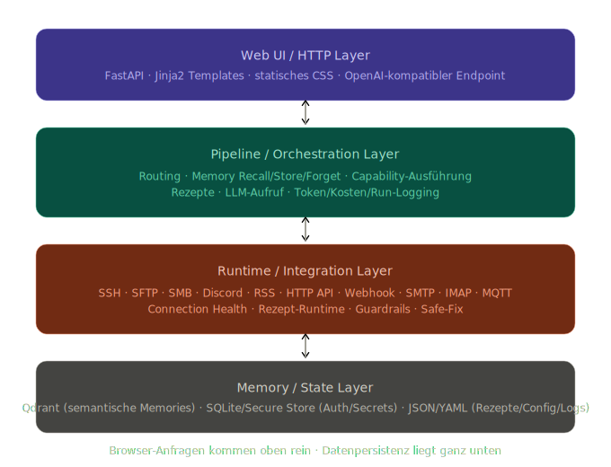
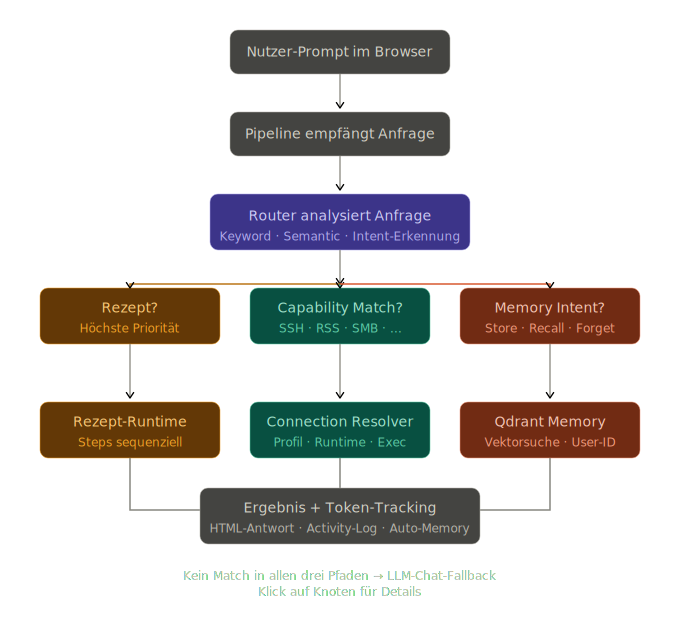
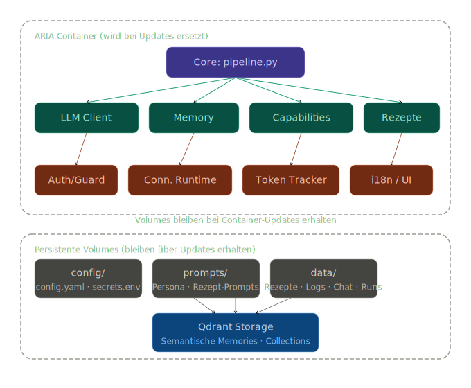

<p align="center">
  
</p>

# ARIA

Lean, modular, self-hosted AI assistant with memory, skills, secure connections, and a browser-first UI.

**GitHub:** [FischermanCH/A.R.I.A.](https://github.com/FischermanCH/A.R.I.A.)  
**Docker Hub:** [fischermanch/aria](https://hub.docker.com/r/fischermanch/aria)  
**Languages:** [English](#english) · [Deutsch](#deutsch)

---
## Screenshots

<table>
  <tr>
    <td align="center" width="50%">
      
      <br>
      <sub><strong>Chat + Skills:</strong> ARIA running a Linux server update workflow.</sub>
    </td>
    <td align="center" width="50%">
      
      <br>
      <sub><strong>Configuration:</strong> browser-based setup for system and provider settings.</sub>
    </td>
  </tr>
  <tr>
    <td align="center" width="50%">
      
      <br>
      <sub><strong>Memory Map:</strong> visual view into ARIA's stored memory structure.</sub>
    </td>
    <td align="center" width="50%">
      
      <br>
      <sub><strong>Skill Builder:</strong> UI for editing and wiring custom skills.</sub>
    </td>
  </tr>
  <tr>
    <td align="center" width="50%">
      
      <br>
      <sub><strong>Statistics:</strong> runtime health, usage, costs, and system status.</sub>
    </td>
    <td align="center" width="50%">
      
      <br>
      <sub><strong>Themes:</strong> different looks and color directions are built in.</sub>
    </td>
  </tr>
  <tr>
    <td align="center" width="50%">
      
      <br>
      <sub><strong>Theme Variant:</strong> another UI style from the same system.</sub>
    </td>
    <td align="center" width="50%">
      &nbsp;
    </td>
  </tr>
</table>


# English
## What ARIA is

ARIA is a small, modular AI assistant for people who want control instead of platform sprawl.

It combines:

- a browser-first chat UI
- structured memory with Qdrant
- configurable skills and automations
- modular connections to real systems
- explicit security and role boundaries

ARIA is intentionally **not** trying to become a giant OpenWebUI-style suite.  
The goal is to stay lean, understandable, and extensible.

## Current ALPHA boundary

- ARIA ALPHA is currently **primarily a personal single-user system**
- User mode is a reduced everyday working view
- Advanced configuration stays behind Admin mode
- Full ownership / sharing / RBAC for skills, connections, and memories is planned as a later architecture step
- ARIA ALPHA is intended for **LAN / VPN / homelab**, not direct public internet exposure

## Who this ALPHA is for

Good fit:

- people who want a personal AI workspace
- self-hosters and homelab users
- tinkerers comfortable with Docker / Portainer
- small private tests with 1-2 trusted users

Not the current target:

- open internet exposure
- production teams
- full multi-user permission setups
- hands-off enterprise deployment

## Current implementation snapshot

- Chat UI at `/`
- Deterministic routing plus custom-skill and capability execution
- Qdrant-backed memory with typed collections, weighted recall, and JSON export
- Connection pages for SSH, SFTP, SMB, Discord, RSS, HTTP API, Webhook, SMTP, IMAP, and MQTT
- Custom Skills as JSON manifests with a browser wizard, import/export, and bundled sample skills
- `Statistics` under `/stats` with health, token/cost stats, connection status, activities, and reset
- Read-only `/help` and `/product-info`
- OpenAI-compatible endpoint `POST /v1/chat/completions`
- Config via `config/config.yaml` plus `ARIA_*` environment overrides
- `/health` endpoint

## Architecture at a glance

### Layered architecture



### Intelligent routing



### Modularity and persistence



## Documentation

- Product overview: `docs/product/overview.md`
- Feature list: `docs/product/feature-list.md`
- Architecture summary: `docs/product/architecture-summary.md`
- Roadmap: `docs/product/roadmap.md`
- Setup overview: `docs/setup/setup-overview.md`
- Portainer deploy checklist: `docs/setup/portainer-deploy-checklist.md`
- Alpha help (DE): `docs/help/alpha-help-system.de.md`
- Alpha help (EN): `docs/help/alpha-help-system.en.md`
- Memory help: `docs/help/memory.md`
- Pricing help: `docs/help/pricing.md`
- Security help: `docs/help/security.md`
- Changelog: `CHANGELOG.md`

## Quickstart

```bash
cd /path/to/ARIA
pip install -e .
cp config/config.example.yaml config/config.yaml
cp config/secrets.env.example config/secrets.env
./aria.sh start
```

Then open:

- ARIA: `http://localhost:8800`
- Stats: `http://localhost:8800/stats`

## App control

```bash
cd /path/to/ARIA
./aria.sh start
./aria.sh status
./aria.sh logs
./aria.sh stop
./aria.sh maintenance
```

Foreground mode:

```bash
./aria.sh start --foreground
```

`aria.sh` reads host and port from `config/config.yaml`. If needed, override them with `ARIA_ARIA_HOST` and `ARIA_ARIA_PORT`.

## Git / container publish safety

Local runtime config and secrets should stay out of Git.

Ignored runtime files/directories include:

- `config/config.yaml`
- `config/secrets.env`
- `data/auth/`
- `data/logs/`
- `data/skills/`
- `data/chat_history/`
- `data/qdrant/`
- `data/runtime/`
- `data/ssh_keys/`

Tracked examples/templates:

- `config/config.example.yaml`
- `config/secrets.env.example`
- `.env.example`

For a new local/container setup:

```bash
cp config/config.example.yaml config/config.yaml
cp config/secrets.env.example config/secrets.env
cp .env.example .env
```

## Autostart

ARIA can manage its own user-level cron autostart:

```bash
cd /path/to/ARIA
./aria.sh autostart-status
./aria.sh autostart-install
./aria.sh autostart-remove
```

`autostart-install` creates:

- `@reboot` startup
- a one-minute watchdog restart check
- daily memory maintenance at `03:17`

## Docker / Compose

```bash
cd /path/to/ARIA
cp config/config.example.yaml config/config.yaml
cp config/secrets.env.example config/secrets.env
cp .env.example .env
```

Set at least this in `.env`:

```dotenv
ARIA_QDRANT_API_KEY=replace-with-a-long-random-key
```

Optional:

```dotenv
ARIA_HTTP_PORT=8800
```

Start:

```bash
docker compose up -d --build
```

Open:

- ARIA: `http://localhost:8800`
- Qdrant: `http://localhost:6333`

First start flow:

1. create the first user
2. that first user becomes Admin automatically
3. Admin mode is active
4. configure LLMs, embeddings, connections, and skills

## Portainer

For Portainer, use `docker/portainer-stack.example.yml` as a base and set stack variables such as:

- `ARIA_QDRANT_API_KEY`
- `ARIA_HTTP_PORT`
- `ARIA_LLM_API_BASE`
- `ARIA_EMBEDDINGS_API_BASE`
- `ARIA_PUBLIC_URL`

Important notes:

- stack examples use named volumes
- empty `config` / `prompts` volumes are initialized from built-in defaults on first container start
- `config.yaml` and `secrets.env` are generated in the volume if missing
- keep the same Qdrant API key for both `aria` and `qdrant`
- on Linux, `host.docker.internal` is wired through `host-gateway` in the compose setup

## Friend tester quickstart

If you want 1-2 trusted people to test ARIA:

1. run ARIA on a separate host via Docker or Portainer
2. keep access inside LAN / VPN
3. let the tester create the first user and configure their own LLM
4. collect feedback on first-run setup, chat quality, connections, memories, and rough UI edges

Please frame it clearly as an **ALPHA**.

## OpenAI-compatible API

```bash
curl -X POST http://localhost:8800/v1/chat/completions \
  -H "Content-Type: application/json" \
  -d '{"messages":[{"role":"user","content":"Hello ARIA"}]}'
```

If `channels.api.auth_token` is configured:

```bash
curl -X POST http://localhost:8800/v1/chat/completions \
  -H "Authorization: Bearer <TOKEN>" \
  -H "Content-Type: application/json" \
  -d '{"messages":[{"role":"user","content":"Hello ARIA"}]}'
```

## Environment override examples

```bash
export ARIA_LLM_MODEL="ollama_chat/qwen3:8b"
export ARIA_LLM_API_BASE="http://localhost:11434"
export ARIA_LLM_TEMPERATURE="0.4"
export ARIA_LLM_MAX_TOKENS="4096"
export ARIA_ARIA_HOST="0.0.0.0"
export ARIA_ARIA_PORT="8800"
```

Secret-related environment variables are resolved centrally:

- `ARIA_MASTER_KEY`
- `ARIA_AUTH_SIGNING_SECRET`
- `ARIA_FORGET_SIGNING_SECRET`

Never commit real secrets into code or YAML.

## Operational notes

- Qdrant must be reachable if `memory.enabled: true`
- if Memory fails, chat should still continue and message details show `memory_error`
- context rollup uses `memory.compression_summary_prompt` (default: `prompts/skills/memory_compress.md`)
- for ALPHA testing, prefer a separate host/container, LAN/VPN access, and avoid mixing highly sensitive real user data into throwaway test instances

## Tests

```bash
./.venv/bin/pytest -q
```

## Public release status

ARIA is close to a first public ALPHA release. The remaining work is mostly release hygiene and end-to-end verification.

## One-line summary

**ARIA is a lean, modular, self-hosted AI assistant with memory, skills, secure connections, and a browser-first interface built for real control instead of platform bloat.**

---

# Deutsch

## Was ARIA ist

ARIA ist ein kleiner, modularer, selbst gehosteter AI-Assistent für Menschen, die Kontrolle statt Plattform-Bloat wollen.

ARIA verbindet:

- eine browser-first Chat-UI
- strukturiertes Memory mit Qdrant
- konfigurierbare Skills und Automationen
- modulare Connections zu echten Systemen
- klare Security- und Rollen-Grenzen

ARIA soll bewusst **keine riesige OpenWebUI-artige Alles-in-einem-Suite** werden.  
Das Ziel ist, klein, verständlich und erweiterbar zu bleiben.

## Aktuelle ALPHA-Grenze

- ARIA ALPHA ist aktuell **primär ein persönliches Single-User-System**
- der User-Modus ist eine reduzierte Arbeitsansicht für den Alltag
- erweiterte Konfiguration bleibt hinter dem Admin-Modus
- Ownership / Sharing / RBAC für Skills, Connections und Memories ist als späterer Architektur-Schritt geplant
- ARIA ALPHA ist für **LAN / VPN / Homelab** gedacht, nicht für direkte offene Internet-Exponierung

## Für wen diese ALPHA gedacht ist

Gut geeignet für:

- Menschen, die einen eigenen AI-Workspace wollen
- Self-Hoster und Homelab-User
- Bastler, die mit Docker / Portainer umgehen können
- kleine private Tests mit 1-2 vertrauenswürdigen Personen

Aktuell **nicht** gedacht für:

- offene Internet-Exponierung
- produktive Teams
- vollständige Multi-User-Berechtigungsmodelle
- hands-off Enterprise-Deployment

## Aktueller Implementierungsstand

- Chat-UI unter `/`
- deterministisches Routing plus Custom-Skill- und Capability-Ausführung
- Qdrant-Memory mit typisierten Collections, gewichtetem Recall und JSON-Export
- Connection-Seiten für SSH, SFTP, SMB, Discord, RSS, HTTP API, Webhook, SMTP, IMAP und MQTT
- Custom Skills als JSON-Manifeste mit Wizard, Import/Export und mitgelieferten Sample-Skills
- `Statistiken` unter `/stats` mit Health, Token-/Kosten-Stats, Connection-Status, Aktivitäten und Reset
- Read-only `/help` und `/product-info`
- OpenAI-kompatibler Endpoint `POST /v1/chat/completions`
- Konfiguration über `config/config.yaml` plus `ARIA_*` ENV-Overrides
- `/health` Endpoint

## Architektur auf einen Blick

### Schichtenarchitektur


### Intelligentes Routing


### Modularität und Persistenz


## Dokumentation

- Produktüberblick: `docs/product/overview.md`
- Feature-Liste: `docs/product/feature-list.md`
- Architektur: `docs/product/architecture-summary.md`
- Roadmap: `docs/product/roadmap.md`
- Setup-Überblick: `docs/setup/setup-overview.md`
- Portainer-Deploy-Checkliste: `docs/setup/portainer-deploy-checklist.md`
- Alpha-Hilfe DE: `docs/help/alpha-help-system.de.md`
- Alpha-Hilfe EN: `docs/help/alpha-help-system.en.md`
- Memory-Hilfe: `docs/help/memory.md`
- Pricing-Hilfe: `docs/help/pricing.md`
- Security-Hilfe: `docs/help/security.md`
- Changelog: `CHANGELOG.md`

## Quickstart

```bash
cd /path/to/ARIA
pip install -e .
cp config/config.example.yaml config/config.yaml
cp config/secrets.env.example config/secrets.env
./aria.sh start
```

Danach öffnen:

- ARIA: `http://localhost:8800`
- Statistiken: `http://localhost:8800/stats`

## App-Steuerung

```bash
cd /path/to/ARIA
./aria.sh start
./aria.sh status
./aria.sh logs
./aria.sh stop
./aria.sh maintenance
```

Im Vordergrund starten:

```bash
./aria.sh start --foreground
```

`aria.sh` liest Host und Port aus `config/config.yaml`. Falls nötig, kannst du beides mit `ARIA_ARIA_HOST` und `ARIA_ARIA_PORT` überschreiben.

## Git-/Container-Publish-Sicherheit

Lokale Runtime-Config und Secrets sollen nicht in Git landen.

Ignorierte Runtime-Dateien/-Ordner:

- `config/config.yaml`
- `config/secrets.env`
- `data/auth/`
- `data/logs/`
- `data/skills/`
- `data/chat_history/`
- `data/qdrant/`
- `data/runtime/`
- `data/ssh_keys/`

Getrackte Beispiele/Templates:

- `config/config.example.yaml`
- `config/secrets.env.example`
- `.env.example`

Für ein neues lokales/containerisiertes Setup:

```bash
cp config/config.example.yaml config/config.yaml
cp config/secrets.env.example config/secrets.env
cp .env.example .env
```

## Autostart

ARIA kann seinen eigenen User-Cron-Autostart verwalten:

```bash
cd /path/to/ARIA
./aria.sh autostart-status
./aria.sh autostart-install
./aria.sh autostart-remove
```

`autostart-install` legt an:

- Start bei Reboot über `@reboot`
- einen Watchdog-Check jede Minute
- tägliche Memory-Maintenance um `03:17`

## Docker / Compose

```bash
cd /path/to/ARIA
cp config/config.example.yaml config/config.yaml
cp config/secrets.env.example config/secrets.env
cp .env.example .env
```

In `.env` mindestens setzen:

```dotenv
ARIA_QDRANT_API_KEY=hier-einen-langen-zufaelligen-key-setzen
```

Optional:

```dotenv
ARIA_HTTP_PORT=8800
```

Starten:

```bash
docker compose up -d --build
```

Im Browser öffnen:

- ARIA: `http://localhost:8800`
- Qdrant: `http://localhost:6333`

First-Run-Flow:

1. ersten Benutzer anlegen
2. dieser erste Benutzer wird automatisch Admin
3. Admin-Modus ist aktiv
4. danach LLMs, Embeddings, Connections und Skills konfigurieren

## Portainer

Für Portainer kannst du `docker/portainer-stack.example.yml` als Basis nehmen und Stack-Variablen setzen, z. B.:

- `ARIA_QDRANT_API_KEY`
- `ARIA_HTTP_PORT`
- `ARIA_LLM_API_BASE`
- `ARIA_EMBEDDINGS_API_BASE`
- `ARIA_PUBLIC_URL`

Wichtige Hinweise:

- die Stack-Beispiele nutzen named volumes
- leere `config`- und `prompts`-Volumes werden beim ersten Start automatisch mit eingebauten Defaults befüllt
- `config.yaml` und `secrets.env` werden im Volume erzeugt, wenn sie noch fehlen
- denselben Qdrant API Key für `aria` und `qdrant` verwenden
- unter Linux ist `host.docker.internal` im Compose-Setup über `host-gateway` verdrahtet

## Friend-Tester-Quickstart

Wenn du ARIA an 1-2 vertraute Tester geben willst:

1. ARIA auf einem separaten Host über Docker oder Portainer betreiben
2. Zugriff auf LAN / VPN beschränken
3. Tester den ersten User selbst anlegen und das eigene LLM konfigurieren lassen
4. Feedback zu First-Run, Chatqualität, Connections, Memories und UI-Reibung sammeln

Bitte klar als **ALPHA** framen.

## OpenAI-kompatible API

```bash
curl -X POST http://localhost:8800/v1/chat/completions \
  -H "Content-Type: application/json" \
  -d '{"messages":[{"role":"user","content":"Hallo ARIA"}]}'
```

Wenn `channels.api.auth_token` gesetzt ist:

```bash
curl -X POST http://localhost:8800/v1/chat/completions \
  -H "Authorization: Bearer <TOKEN>" \
  -H "Content-Type: application/json" \
  -d '{"messages":[{"role":"user","content":"Hallo ARIA"}]}'
```

## ENV-Override-Beispiele

```bash
export ARIA_LLM_MODEL="ollama_chat/qwen3:8b"
export ARIA_LLM_API_BASE="http://localhost:11434"
export ARIA_LLM_TEMPERATURE="0.4"
export ARIA_LLM_MAX_TOKENS="4096"
export ARIA_ARIA_HOST="0.0.0.0"
export ARIA_ARIA_PORT="8800"
```

Secret-ENV-Variablen werden zentral aufgelöst:

- `ARIA_MASTER_KEY`
- `ARIA_AUTH_SIGNING_SECRET`
- `ARIA_FORGET_SIGNING_SECRET`

Echte Secrets bitte nie in Code oder YAML committen.

## Betriebshinweise

- Qdrant muss erreichbar sein, wenn `memory.enabled: true`
- bei Memory-Fehlern läuft der Chat weiter, Message-Details zeigen dann `memory_error`
- Kontext-Rollup nutzt `memory.compression_summary_prompt` (Default: `prompts/skills/memory_compress.md`)
- für ALPHA-Tests besser separater Host/Container, LAN/VPN-Zugriff und keine hochsensiblen Echtdaten in Wegwerf-Testinstanzen

## Tests

```bash
./.venv/bin/pytest -q
```

## Public-Release-Status

ARIA ist nah an einem ersten Public-ALPHA-Release. Der Rest ist vor allem Release-Hygiene und End-to-End-Verifikation.

## Ein-Satz-Zusammenfassung

**ARIA ist ein schlanker, modularer, selbst gehosteter AI-Assistent mit Memory, Skills, sicheren Connections und browser-first UI für echte Kontrolle statt Plattform-Bloat.**
